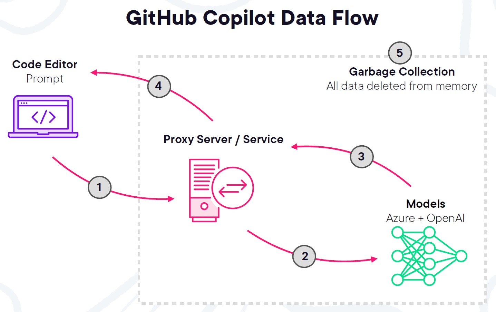
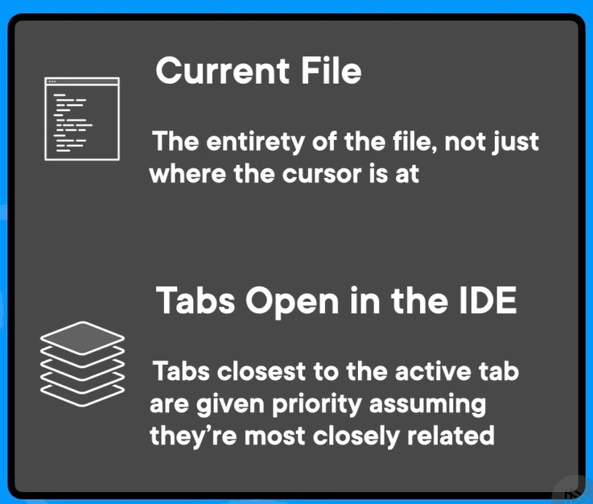
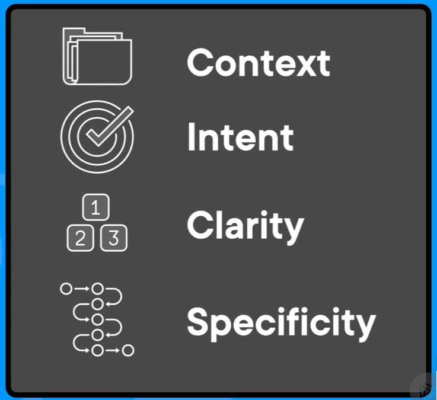
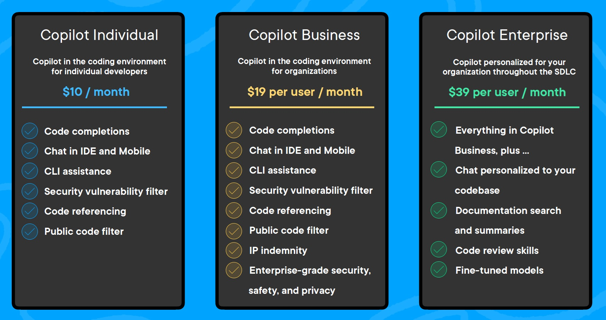
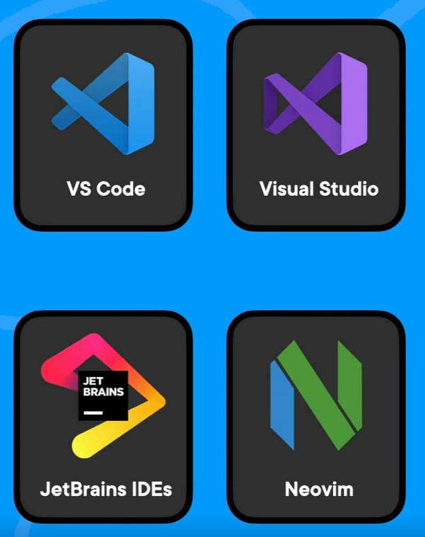

# Getting Started with GitHub Copilot

Before we dive into its many features and different options on how it can be used by the individual developer, organizations, and even enterprises, let's take a quick step back and see how GitHub got to this point.

With the public launch of ChatGPT in November of 2022 that catapulted AI into nearly every industry, GitHub's journey with AI actually started a couple of years prior to that in 2020 when their engineers started working with OpenAI's GPT‑3 model with a these questions in mind: is an automated pair programmer fact or fiction? Could AI intelligently, realistically, and seamlessly benefit the developer with their everyday tasks? And can it truly act as a pair programmer?

Well, to do this, GitHub put together a series of standard coding exercises that could be commonly found in coding job interviews. They fed these exercises into this AI model to see what would happen. And back in 2020, GitHub states that out of 233 handcrafted programming exercises supplied by 30 GitHub engineers, 93% of those were successfully solved.

This was 2 years before the public release of ChatGPT and what the CEO of GitHub Thomas Dohmke states was the genesis and the moment that would solidify GitHub into its AI journey.

Now, in response to their question, if AI could be a pair programmer, GitHub concluded that OpenAI's technology is poised to change developer tools in fundamental ways. In particular, an automated pair programmer can be built that puts the collective knowledge of the entire GitHub community at the fingertips of every individual.

GitHub then got to work and created the first at scale AI pair programmer, and they call it GitHub Copilot. Now they have over 1 million paid users in over 190 countries, making GitHub Copilot the most widely adopted AI developer tool in history.

## Basic understanding of data flow

As we dive into the mechanics and data flow of GitHub Copilot, it's important to note that depending on which feature of Copilot you're using, for example, Copilot Chat or Copilot Code Completion, there are slight differences to the mechanics and data flow.

Let's focus on the mechanics behind the core GitHub Copilot feature of code completion for this workshop. This is the embedded experience inside your IDE where you add comments or code, Copilot will generate suggestions based on that information.

### How GitHub Copilot Code Completion feature works

1. As a basic overview, as you're typing out comments or code, context from your project is provided to Copilot.
1. This context is then sent to a large language model powered by OpenAI behind the scenes.
1. The large language model, or LLM, analyzes what you're trying to do and then generates custom suggestions.
1. Which then Copilot gathers together, and provides to you in your IDE.

You can then accept those suggestions, reject them, or even modify them as needed. You have control to use it as a foundation and a helpful guide. This is great to get suggestions on next steps or how to format code or use obscure syntax that you never seem to remember.

### Context is key

There can be some confusion on what exactly is used as context from my project when I use GitHub Copilot.

The first thing is the file that you're currently working in. Copilot doesn't just look where your cursor is located in the file, but the entire file. It scans the beginning, the end, and the middle, all of that information is provided to Copilot. So, if we're going in and making updates and adding new code to the file, Copilot will look at the entire file and not just where we're adding the changes.

The next part of context that is provided to Copilot are the other open tabs within the IDE. It's important to mention that your entire project is not used as context when you're using GitHub Copilot. If you're working in a large project, if Copilot scanned the entire project, that would be a lot of files and information for Copilot to parse through and generate suggestions. Most of that data wouldn't be relevant to the specific code suggestions you're looking for. But, even if the entire project data is unnecessary, it would be useful for Copilot to see some files within the project that are relevant to the file you're working in. For example, if you're working in an index.html file that references a CSS file and you want to call a new CSS class inside a div element within that index.html file, it would be useful for Copilot to have context of that CSS file to provide custom suggestions to you with that CSS file as context, instead of just generic information. You can tell GitHub Copilot to look at specific files by using tabs within your editor. In addition, Copilot will focus most on the tab next to the file that you're in and will work its way to the other tabs if opened.

### Prompt Crafting Best Practices

Generative AI has opened up incredible possibilities, especially when it comes to generating content. However, the secret sauce lies in giving the AI the right instructions. We call these instructions prompts. Essentially, prompts guide the AI on what you want it to create. And crafting a good prompt is like giving the AI a road map, it helps it know where to go and how to get there.

Prompt crafting is the art on how you put your prompts together. It's providing clear instructions to computer programs, such as the large language models powered by OpenAI that drive GitHub Copilot.

So, in other words, prompt crafting is about how we're going to phrase and type out our comments in code for Copilot it to use as context as it generates suggestions. Prompt crafting is a series of best practices that you can use to get the most out of these generative AI tools. And because GitHub Copilot is a tool, we can spend some time in learning how to get the most out of this tool, just like any other tool in our IDE.

So, let's break this down into components:

1. We've already touched on the first one, which is **context**: this is the surrounding information that we provide for Copilot to better provide relevant and useful suggestions. This is the open tabs that we talked about earlier.
1. We also have **intent**: what is that we're trying to build and how are we trying to build it? Are we providing Copilot the specific goal that we have in mind when a prompt?
1. We also have **clarity**: are we providing Copilot with clear, simple, and concise instructions, or are we giving Copilot confusing and ambiguous information that is left to multiple interpretations?
1. Next is **specificity**: this is the level of detail about the task that you wish to complete.

> *If I tell Copilot to build me a sandwich, what kind of sandwich would I get back? Would it be peanut butter and jelly sandwich, a turkey club sandwich, or maybe a BLT, the bacon, lettuce, and tomato? How do I want that sandwich made? Do I want white bread or wheat bread? Do I want pickles or perhaps a little bit of peppers for some added spice? Just telling AI to make a sandwich without proper, detailed, and simple instructions, will leave me with the end result that is undesirable and not anything close to what I was looking for.*

With the rise of generative AI, prompt crafting is a hot topic. In short, best practices for prompt crafting with GitHub Copilot are to set the stage with the high‑level goal. When prompting GitHub Copilot, think of the process as having a conversation with someone:

* How should I break down the problem so we can solve it together?
* How would I approach pair programming with this person?
* Make your ask simple and specific.
* Don't provide too many different requests in the same prompt.
* GitHub Copilot better understands your goal when you break things down.
* It's helpful for Copilot to see an example or two, this can be done by opening relevant tabs for context or providing an actual example in the prompt. Learning from examples is not only useful for humans, it's also useful for GitHub Copilot.

## Frequently Asked Questions

### Which coding languages does GitHub Copilot support?

GitHub Copilot works with all languages that appear in public repositories on GitHub. This includes popular languages like JavaScript, C#, Python, Java, TypeScript, Ruby, Go, C++, and many more.

The level and quality or responses vary between the languages. It will depend on the volume and diversity of data that GitHub Copilot is trained on. So for example, JavaScript is a well‑represented language in public repositories and is one of GitHub Copilot's best supporting languages. Other languages with less representation in public repositories may produce fewer or less robust suggestions.

Over time, GitHub Copilot will only get better and more robust as more data is fed into its training models.

### Is code from GitHub Copilot secure?

Since GitHub Copilot offers suggestions from a model that OpenAI built from billions of lines of open source code, it's possible that a training set provided to the model may contain insecure coding patterns, bugs, or references to outdated or incorrect information.

⚠️ It's your responsibility to ensure the quality and security of your code, especially when accepting code suggestions from AI‑produced results. Take precautions when using code generated from GitHub Copilot just like you would when reviewing code suggestions from Stack Overflow, a team member, or just about anything you didn't write yourself.

Some common precautions that you can take include robust testing and setting up automated tracking for security vulnerabilities. GitHub provides several features that are free to use in public repositories to help you monitor, secure, and improve the quality of your code such as code scanning and Dependabot. We won't cover those in this workshop, but navigating to [GitHub Advanced Security's documentation](https://docs.github.com/en/get-started/learning-about-github/about-github-advanced-security) can provide more insight into enabling these features in your own GitHub repositories.

One more thing when it comes to the core product of GitHub Copilot is that it will filter and block offensive words and sensitive information from its provided suggestions.

### Is GitHub Copilot free?

GitHub Copilot is a paid feature that requires a monthly or yearly subscription. GitHub does provide GitHub Copilot for free to verified students, teachers, and maintainers of popular open source projects. Anyone wanting to try out Copilot for the first time can do so with a [30‑day free trial](https://github.com/github-copilot/signup).

Once you decide to have Copilot for yourself, you have three options, Copilot Individual, Copilot Business, and Copilot Enterprise. With Copilot Individual, it's $10/month or $100/year. This includes things like code completions, Copilot Chat, and other features like chat in IDE and mobile, CLI assistance, security vulnerability filter, code referencing, and public code filter.

Copilot for Business is $19 per user per month and is for organization or enterprise accounts. It comes with features from Copilot Individual, but with added features like organization‑wide policy management, audit logs, HTTP proxy support, and enterprise‑grade security safety and privacy.

Copilot Enterprise is an enhanced version of Copilot Business. It includes everything in Business, but with the addition of Copilot Chat personalized to your code base, documentation search and summaries, pull request summaries, code review skills, and fine‑tuned models specific to your codebase. This option is for $39 per user per month.

### What IDEs does GitHub Copilot support?

GitHub Copilot is available in the following IDEs:

* Visual Studio Code
* Visual Studio
* JetBrains IDEs
* Vim or Neovim

## More resources

