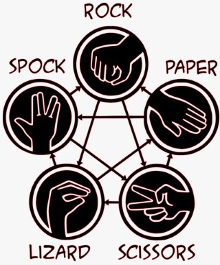

# Rock, Paper, Scissors in Dotnet and Visual Studio

In this workshop, we'll explore how to create a Rock, Paper, Scissors game using GitHub Copilot in Visual Studio. We'll understand how GitHub Copilot can help us build a simple game.

## What is Rock, Paper, Scissors?

Rock, Paper, Scissors is a hand game that is usually played between two people. The players count to three in unison and simultaneously throw one of three hand signals that correspond to rock, paper, or scissors. The winner is determined by the rules:

- Rock crushes scissors
- Scissors cuts paper
- Paper covers rock

## Let's add Lizard and Spock

In the game, we'll add two more options: Lizard and Spock. The rules are:

- Rock crushes scissors
- Scissors cuts paper
- Paper covers rock
- Rock crushes lizard
- Lizard poisons Spock
- Spock smashes scissors
- Scissors decapitates lizard
- Lizard eats paper
- Paper disproves Spock
- Spock vaporizes rock

