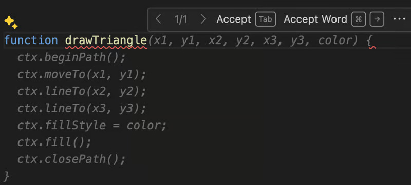

# GitHub Copilot Top Features

## Real Time Suggestions

As you type code into your IDE GitHub Copilot will give you suggestions in the form of "*ghost text*". When this text appears you can choose to accept it, cycle through different options or decline it.

## Inline Chat

The inline chat allows you to ask Copilot to modify code in the current open file.

## Voice to Code

There is something satisfying about being able to communicate with your IDE verbally to complete a task. With the inline chat open click the microphone button and ask copilot a question or to perform a task on the open file.

## Test Generation

Not only can you ask Copilot to generate tests for you but you can do it quicker by using the `/tests` command. You can ask it to generate tests for an entire file or a single function.

## Doc Generation

Documentation can be easily generated by using the `/doc` command

## Fix Errors

With the `/fix` command you can ask GitHub copilot to find and fix issues.

## Explain Code

Working on a new code base you that you don't understand? Problem solved you can use the `/explain` command to explain how the code works. Highlight the code you want explain and ask in the inline chat or ask it to explain the entire file.

## Chat Panel

The chat panel is an interactive chat where you can ask questions back and forth with GitHub Copilot. It's the same as using Chat GPT except that you can only ask questions that are related to software development.

## Commit Message Generation

GitHub copilot makes it easy to generate commit messages from within VS Code. Just click the sparkle icon next to the commit message text box.

## Agents

There are three agents Workspace, VS Code and Terminal. Agents setup the context for the chat panel and allow Copilot work in a sandboxed environment of your code.

### Workspace Agent

The GitHub Copilot `@workspace` agent enhances code suggestion capabilities by analyzing and understanding the entire context of your workspace, enabling it to make informed recommendations that align with your project's architecture and dependencies. It supports project-specific customization and advanced refactoring, improving code consistency and quality across multiple files.

### VSCode Agent

The `@vscode` agent allows you to ask questions about VS Code. It uses the documentation for VS Code to find your answer and guide you with instructions. For example you could ask `@vscode how do I change my theme`

### Terminal agent

The @terminal agent allows you to ask question about terminal commands or even create commands. For example you could ask @terminal how do I commit using git

## Sparkles

Follow the sparkles. Anywhere you see a sparkle give it a click and see what GitHub copilot can do for you.

