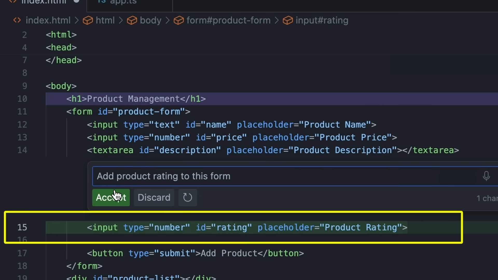

# What not to do in Copilot to use it optimally

## Don't let it fly the plane

* It's meant to be an assistant, not a replacement for you (the real pilot)
* Don't ask it to write an enterprise-grade application for you and assume success
* It does not produce optimal secure code
* Letting it write code without your review may hinder productivity, you're still responsible for all the code that Copilot generates

## Don't misuse Copilot tools

* You can eat spaghetti with a spoon, but it's not the best tool for the job
* When prompting Copilot, you want to use it efficiently
  * Here in this example is a typical misuse of Copilot
    
    We're tempted to write a comment to prompt it
  * To get suggestions from Copilot, I could use "Ghost Text" to get suggestions for the next line of code just by hitting "Enter" key
  * If you know specifically what I want to add next, you should use "inline chat"
    
  * Alternatively, you can use the chat window
    
    
    but this is more conversational, perhaps more appropriate for longer prompts like this
    

## Don't recreate existing prompts

* You can highlight code and ask copilot to fix the issue
  
* Instead use the quicker "Slash Command" to get suggestions for the highlighted code
  
* Keep in mind you have even more options from the chat panel
  

## Don't forget about context

Context is everything and the clearer the context, the more relevant the suggestions from Copilot

* When having conversation with Copilot Chat Panel, and the suggestions you're getting are off track, you can go back and delete the previous messages to provide more context
  
* Always have the part of the code you're asking about *highlighted* so Copilot can provide more relevant suggestions
* Use the "@workspace" command to provide context for the entire file
  
* To add files as context so Copilot can take that into account, open the relevant files in the editor
* using the up arrow will allow you to scroll through previous prompts you've written
  

